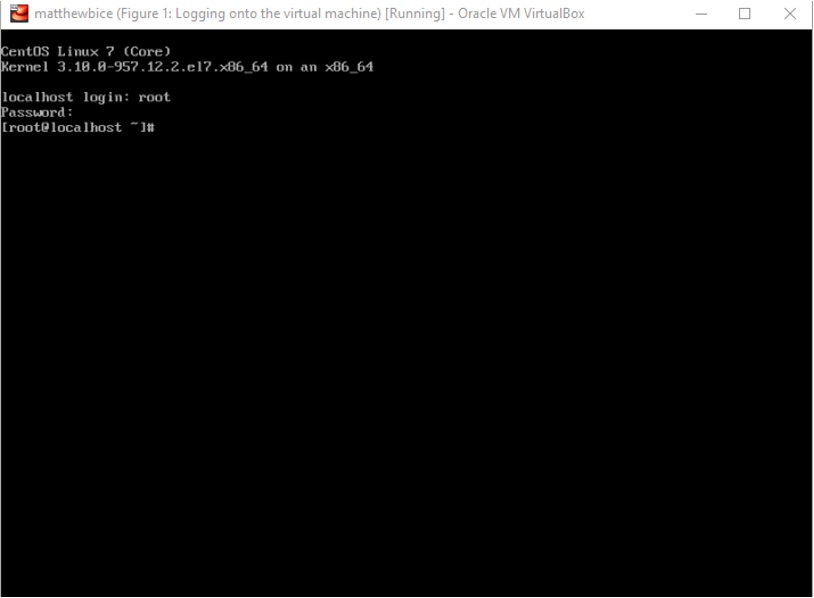
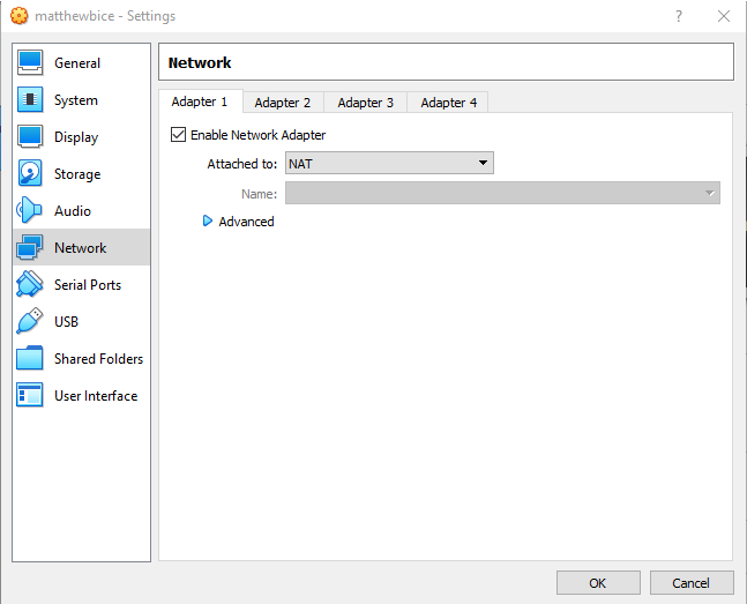
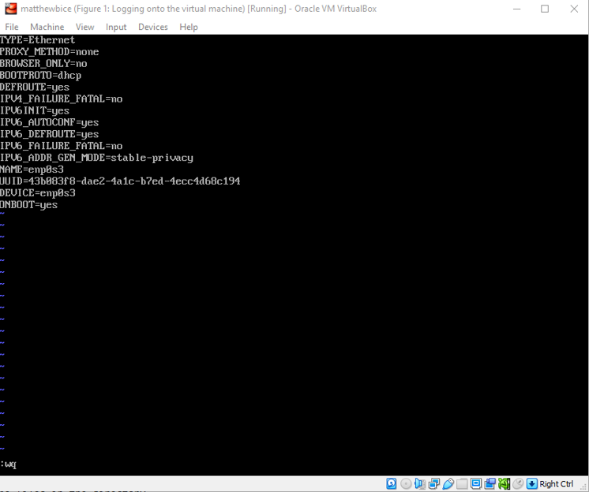
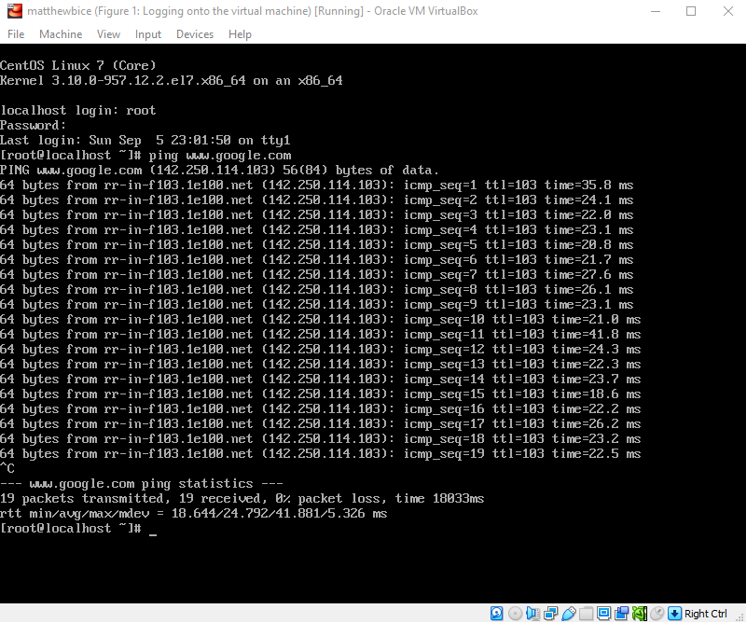
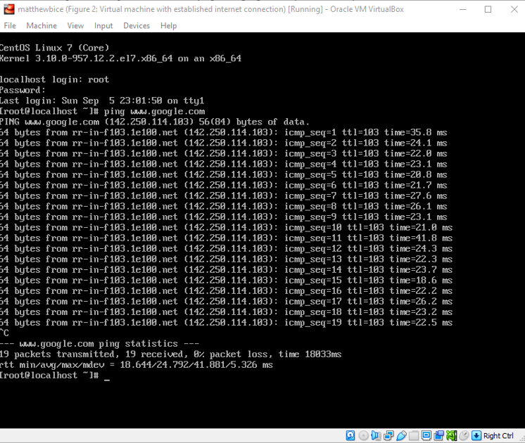

# Introduction

This lab is dedicated to installing CentOS, an operating system, onto a user-created virtual machine and setting up a network connection using the software VirtualBox. The purpose of this lab is to familiarize myself with CentOS and terms of its setup and connection processes.

# Installing VirtualBox and Creating a CentOS 7 Virtual Machine

## Installing VirtualBox and Downloading the CentOS Build

To begin, I access the VirtualBox website and acquire a download link for the software. According to its official website, VirtualBox is “a powerful virtualization product intended for server, desktop, and embedded use.” This means that the software creates virtual workstations that can be interfaced through the user’s personal computer. Moreover, the software is open source under GNU GPL version 2 meaning that the software provides total flexibility in terms of both modification and sharing. For this lab, I will be using version 6.1.26 with a 64-bit Windows operating system.

The installation process itself is straightforward with only a few prompt windows. In them, the installation wizard informs me that it will be installing the Oracle Corporation Serial Bus driver, Oracle Corporation Network Adapters, and Oracle Corporation Network Service. It is my understanding that the serial bus driver enables compatibility with VirtualBox while the network adapters and service will allow internet connections to be established through the virtual machine. The installation then completes, and the software is now ready to launch on my computer.

Next up, I must download the 64-bit version of CentOS ISO image. Using the link provided in the instructions, I directly download the CentOS-7-x86_64-Minimal.iso file. This file is an installer of a minimal build of CentOS. This means that virtual machine interface will be command line only. As an aside, the file is considerably large, and took around 30 minutes (rounding up) to download. With it finally installed, I am ready to launch VirtualBox and begin the creation of my virtual machine.

## Configuring and Creating the CentOS Virtual Machine

To create a new virtual machine, I open VirtualBox and select “new.” From there, I must specify the parameters of my virtual machine. I start by giving the machine a name. For this lab (and those hereafter), my virtual machine name is “matthewbice.” From there, the type is set to “Linux,” and I select the version Red Hat (64-bit). As the software recommends, I will be working with a memory size of 1024 MB. Next, an additional prompt window appears asking me to specify my desired hard disk type. I select the default setting, VDI (VirtualBox Disk Image). This hard disk will have a size of 20 GB. An interesting aside, VirtualBox takes up memory from my physical hard drive dynamically, so I will not have to worry about excessive memory usage. With these parameters in place, the virtual machine is now created.

The next step is to apply the downloaded CentOS onto my newly created virtual machine. I access the storage settings and insert the CentOS-7-x86_64-Minimal.iso image as the controller. This does not, however, mean that CentOS has been installed directly onto the virtual machine yet.

This section of the lab was especially difficult for me. Initially, VirtualBox was only giving me 32-bit versions of all the operating systems. At first, I only regarded this as an unfortunate limitation to the lab; however, I quickly realized that the rest of the lab becomes impossible if I try to continue. The issue, as VirtualBox stated, was that the host machine did not have virtualization enabled and therefore could not create and launch the virtual machine. To fix this, I had to manually go into my own computer’s BIOS and enable virtualization manually. This took some trial and error, however, since I have an Asus computer and Intel processor and had to find the appropriate settings. Eventually, I discovered that the setting in question was Intel VMX Virtualization Technology. After enabling it and restarting my computer again, VirtualBox was now working as intended.

## Running the Virtual Machine and Installing CentOS

With everything in place, I hit “start,” and my virtual machine is powered on. Immediately after, the machine runs the CentOS installer that I had previously loaded onto the hard drive. From here, I hit “enter” and begin the installation process.

The process begins with the configuration of the date and time. Satisfied with the default settings, I left them as they are. Next, I specified the installation destination to be the hard disk that I created earlier. After setting this, the installation begins.

While the OS is installing, I needed to setup the root account for the system which, as the directions indicate, will act similarly to the Super Administrator Account in Windows. Though the username is predetermined to be “root,” I still had to make my own password. Password strength and security is not the focus of this lab. Therefore, I set my password to simply be “password.” A few minutes after my account setup, the installation is complete, and I now must reboot the system.

Once the reboot cycle is complete, the virtual machine loads up with my build of CentOS loaded. As previously mentioned, this is a minimal build, so my only mode of interfacing with the virtual machine is through the command terminal. I then log in with my newly created credentials and now have access to the machine.

- _Figure 1_: The command terminal for my virtual machine. Notice that CentOS has been installed and is currently running on the machine. It also recognizes the name “root” and grants me access to the system after I enter the password I created (which is not shown). The prompt “[root@localhost ~]#” signifies that my credentials have been accepted.

  

# Setting Up a Network Connection for CentOS

## Selecting the Network Mode

Although I have fully accessed my machine, I must now switch it off and return to VirtualBox. After accessing the network settings, I am instructed to select “NAT” for the “Attached to” dialogue. Data backup and protection company NAVIKO explains that NAT, or Network Address Translation, is a setting that allows connection to the internet through a guest operating system. Interestingly, this option was already selected when I had opened the window.

- _Figure 2_: The network settings panel in VirtualBox. The checkbox indicates that the network adapter (the one that was installed during the initial VirtualBox installation) is enabled and that it will work through Network Address Translation.

  

## Editing the Network Configuration File

With the network adapter set up, it is now time to do some hands-on work on the virtual machine itself. After launching it and logging in again, I type the commands given in the instructions. First, I type “cd /etc/sysconfig/network-scripts/”. The “cd” command tells the terminal to “change directory” to the desired path. In this case, our focus is in the “network-scripts” directory. Next, I type “ls” which simply lists the contents in the directory. The file of interest on my machine is titled “ifcfg-enp0s3.” 

With the file in sight, I type the command “vi ifcfg-enp0s3”. The “vi” command access Unix’s visual editor. This is a text editor in the sense that text is used to edit the files. This command brings up a series of properties about our file of interest. The focus is on the bottom line, which states “ONBOOT=no”. The objective here is to use vi to modify the property so that it reads “ONBOOT=yes”. To do so, I press “i” which swaps to vi’s editing mode. From there, I use the arrow keys to navigate to the bottom of the list and to the right of the equal’s sign. Then it is simply a matter of changing “no” to “yes.” Once this is done, I hit the escape key to exit the editing mode, and type “:wq” to save the changes and exit the text editor. The section is finished by typing the command “reboot” to reboot the machine.

- _Figure 3_: The virtual machine’s terminal window displaying the “ifcfg-enp0s3” file in vi. Notice that at the bottom, the initial “ONBOOT=no” command has been changed to “ONBOOT=yes”. At the bottom, you can see the editor has been exited and I am saving the changes with the “:wq” command. Not pictured is the “reboot” command that is entered thereafter.

  

## Testing the Newly Established Internet Connection

After rebooting and logging in, the changes I made in the previous section have taken effect. To test this, I enter the command “ping www.google.com” to see if I get any responses from the server. The screenshot below shows the result of this test, and the one thereafter shows a snapshot of the machine being made:

-_Figure 4_: The results of the command “ping www.google.com”. As the summary at the bottom explains, 19 ping packets were transmitted, 19 were received, and there was 0% packet loss. This means that there is an established internet connection between my virtual machine and Google’s servers. Therefore, my virtual machine is connected to the internet.

  

- _Figure 5_: A new snapshot of the machine with an internet connection. The command terminal is in the same state, but the main interest here is that a new snapshot has been saved of my machine as is indicated by the new figure number in the header.

  

# Conclusion

Overall, I feel that this lab is a good introduction to the operating systems and virtual machines that will be covered in this course. The processes were fairly easy, and all of the concepts were straightforward. My only criticism is that the directions could have been a bit more explicit in mentioning that virtualization for my computer must be enabled. In terms of limitations, I would say the only one is that I prematurely captured a snapshot of my machine by mistake thinking it would take a screenshot. This did not seem to affect the lab in any significant way, but it is worth mentioning since it is a deviation from the instructions. Nevertheless, the lab was completed to satisfaction, and I now have a better understanding of CentOS and VirtualBox.

# References

<a href="https://www.nakivo.com/blog/virtualbox-network-setting-guide/" target="_blank" rel="noopener noreferrer">
  VirtualBox Network Settings: All You Need to Know
</a>
